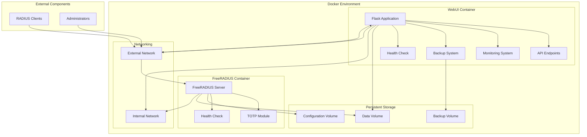

# FreeRADIUS TOTP Management System

A comprehensive authentication system combining FreeRADIUS with Time-based One-Time Password (TOTP) authentication, managed through a web interface.


## Table of Contents

- [Overview](#overview)
- [Features](#features)
- [System Architecture](#system-architecture)
- [Prerequisites](#prerequisites)
- [Installation](#installation)
- [Configuration](#configuration)
- [Usage](#usage)
- [API Documentation](#api-documentation)
- [Monitoring](#monitoring)
- [Backup and Restore](#backup-and-restore)
- [Security Considerations](#security-considerations)
- [Deployment](#deployment)
- [Troubleshooting](#troubleshooting)
- [Contributing](#contributing)
- [License](#license)

## Overview

The FreeRADIUS TOTP Management System provides a comprehensive authentication solution that combines the security of RADIUS with the convenience of Time-based One-Time Password (TOTP) authentication, all managed through an intuitive web interface.

This system is designed for organizations that need to:
- Implement two-factor authentication for network access
- Centrally manage user credentials and TOTP tokens
- Monitor authentication attempts and system performance
- Provide a user-friendly interface for administrators

## Features

### Core Features

- **User Management**: Create, update, delete, and search users
- **TOTP Token Management**: Generate QR codes for Google Authenticator
- **RADIUS Client Management**: Configure network devices that will authenticate against the server
- **Authentication Logs**: View success/failure logs and analytics
- **API Access**: REST API for programmatic access
- **Multi-administrator Support**: Role-based access control for administrators

### Advanced Features

- **System Monitoring**: Real-time monitoring of system health and performance
- **Backup Management**: Create, download, and restore system backups
- **Audit Trail**: Track all administrative actions for compliance
- **Performance Dashboard**: Visualize system performance metrics
- **SSL/TLS Support**: Secure communication with HTTPS

## System Architecture

The system consists of multiple Docker containers working together:

1. **FreeRADIUS Container**: Core authentication server with TOTP module
2. **Web UI Container**: Flask-based web interface for administration
3. **Shared Data Volumes**: Persistent storage for configuration and database



## Prerequisites

- Docker Engine (version 20.10.0 or higher)
- Docker Compose (version 2.0.0 or higher)
- 1 GB RAM minimum (2 GB recommended)
- 10 GB disk space minimum
- Network connectivity for RADIUS clients

## Installation

### Quick Start

1. Clone this repository:
   ```bash
   git clone https://github.com/yourusername/freeradius-totp-management.git
   cd freeradius-totp-management
   ```

2. Generate SSL certificates (optional but recommended):
   ```bash
   ./certs/generate-certs.sh
   ```

3. Start the containers:
   ```bash
   docker-compose up -d
   ```

4. Access the Web UI at http://localhost:8080 (or https://localhost:8080 if SSL is enabled)

### Default Credentials

- Web UI Admin: `admin` / `changeme`
- Test RADIUS User: `testuser` / `password`

⚠️ **Important**: Change the default credentials immediately after first login!

## Configuration

### Environment Variables

The system can be configured using environment variables:

#### FreeRADIUS Container

| Variable | Description | Default |
|----------|-------------|---------|
| `TZ` | Timezone | `UTC` |
| `SQLITE_DB` | Path to SQLite database | `/data/sqlite/radius.db` |

#### Web UI Container

| Variable | Description | Default |
|----------|-------------|---------|
| `TZ` | Timezone | `UTC` |
| `SQLITE_DB` | Path to SQLite database | `/data/sqlite/radius.db` |
| `ADMIN_USER` | Default admin username | `admin` |
| `ADMIN_PASSWORD_HASH` | Default admin password hash | `changeme` |
| `USE_SSL` | Enable SSL | `false` |
| `SSL_CERT` | Path to SSL certificate | `/app/ssl/server.crt` |
| `SSL_KEY` | Path to SSL private key | `/app/ssl/server.key` |
| `BACKUP_DIR` | Path to backup directory | `/data/backups` |

### Custom Configuration

For advanced configuration, you can modify the following files:

- `freeradius/config/radiusd.conf`: Main FreeRADIUS configuration
- `freeradius/config/clients.conf`: RADIUS client configuration
- `freeradius/config/mods-available/sql`: Database connection settings
- `freeradius/config/mods-available/totp`: TOTP module settings

## Usage

### User Management

1. Log in to the Web UI
2. Navigate to "User Management"
3. Create, edit, or delete users
4. Set up TOTP tokens for users

### TOTP Setup

1. Create a user with TOTP enabled
2. Scan the QR code with Google Authenticator or a compatible app
3. Verify the token to complete setup

### Client Management

1. Navigate to "Client Management"
2. Add network devices that will authenticate against the RADIUS server
3. Configure shared secrets and IP restrictions

### Monitoring

1. Navigate to "System Monitoring"
2. View real-time system health and performance metrics
3. Check authentication success/failure rates

### Backup and Restore

1. Navigate to "Backup Management"
2. Create on-demand backups
3. Download backups for off-site storage
4. Restore from a previous backup if needed

## API Documentation

The system provides a comprehensive REST API for programmatic access. For detailed documentation, see [API Documentation](http://localhost:8080/api-docs) in the Web UI.

### Authentication

API requests require an API key, which can be generated in the Web UI under "API Keys".

### Example API Request

```bash
curl -H "X-API-Key: your-api-key" http://localhost:8080/api/users
```

## Monitoring

The system includes built-in monitoring capabilities:

- **System Health**: CPU, memory, and disk usage
- **FreeRADIUS Status**: Service availability and performance
- **Authentication Metrics**: Success/failure rates and trends
- **Database Statistics**: Size, growth, and performance

## Backup and Restore

### Creating Backups

1. Navigate to "Backup Management" in the Web UI
2. Click "Create Backup" to generate a new backup
3. Download the backup file for off-site storage

### Restoring from Backup

1. Navigate to "Backup Management" in the Web UI
2. Click "Restore Backup" and select a backup file
3. Confirm the restoration process

## Security Considerations

For production deployments, consider the following security measures:

- **Change Default Credentials**: Immediately change the default admin password
- **Use SSL/TLS**: Enable HTTPS for the Web UI
- **Network Security**: Restrict access to the RADIUS and Web UI ports
- **Regular Updates**: Keep the system and its dependencies up to date
- **Strong Passwords**: Implement and enforce strong password policies
- **Backup Security**: Store backups securely and encrypt sensitive data
- **Audit Logging**: Regularly review the audit logs for suspicious activity

## Deployment

### Production Deployment

For production environments, additional considerations include:

- **High Availability**: Deploy multiple instances with load balancing
- **Monitoring**: Integrate with external monitoring systems
- **Backup Strategy**: Implement automated, scheduled backups
- **Security Hardening**: Follow security best practices for Docker and network configuration

### Docker Swarm Deployment

For high-availability setups, you can deploy the system using Docker Swarm:

1. Initialize a Docker Swarm:
   ```bash
   docker swarm init
   ```

2. Deploy the stack:
   ```bash
   docker stack deploy -c docker-compose.yml radius-totp
   ```

## Troubleshooting

### Common Issues

#### Web UI Not Accessible

- Check if containers are running: `docker-compose ps`
- Check container logs: `docker-compose logs webui`
- Verify network configuration and firewall settings

#### Authentication Failures

- Check FreeRADIUS logs: `docker-compose logs freeradius`
- Verify client configuration in `clients.conf`
- Test authentication using `radtest`

#### Database Issues

- Check database connectivity: `docker-compose exec webui sqlite3 /data/sqlite/radius.db .tables`
- Verify database permissions and ownership

### Logs

- FreeRADIUS logs: `docker-compose logs freeradius`
- Web UI logs: `docker-compose logs webui`
- Authentication logs: Available in the Web UI under "Auth Logs"
- Audit logs: Available in the Web UI under "Audit Trail"

## Contributing

Contributions are welcome! Please feel free to submit a Pull Request.

## License

This project is licensed under the MIT License - see the LICENSE file for details.
