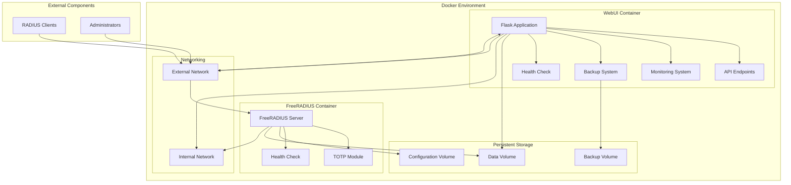
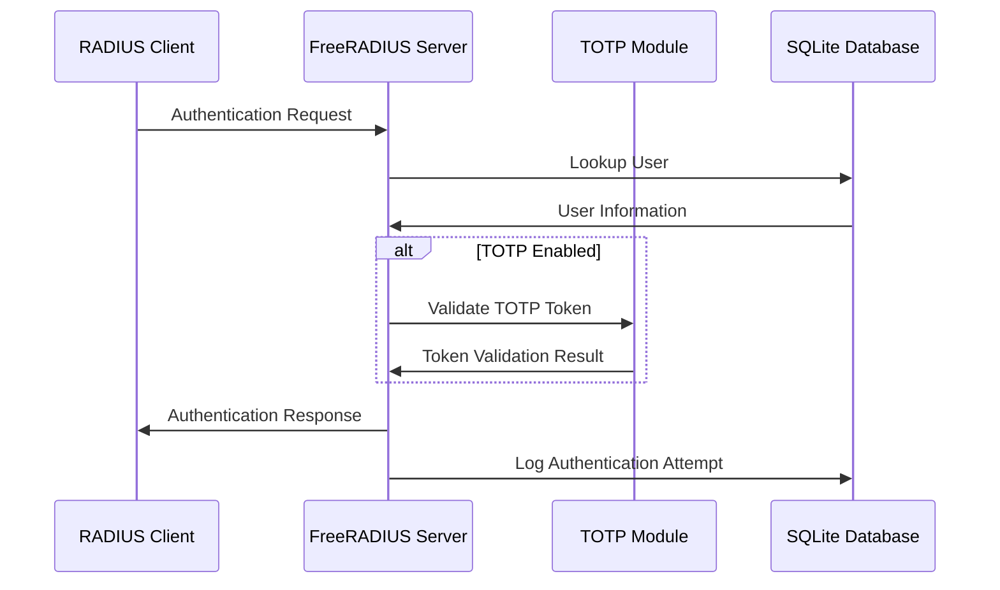

# System Architecture

This document provides a detailed overview of the FreeRADIUS TOTP Management System architecture.

## Overview

The FreeRADIUS TOTP Management System is designed as a containerized application with multiple components working together to provide a comprehensive authentication solution. The system leverages Docker and Docker Compose for easy deployment and management.

## Component Diagram

## Components

### 1. FreeRADIUS Container

The FreeRADIUS container is responsible for handling authentication requests from RADIUS clients. It includes:

- **FreeRADIUS Server**: The core RADIUS server that processes authentication requests
- **TOTP Module**: A custom module that enables Time-based One-Time Password authentication
- **Health Check**: A mechanism to verify the server's operational status
- **SQLite Integration**: Connection to the shared SQLite database for user and configuration data

#### Key Files and Directories

- `/etc/raddb/`: FreeRADIUS configuration directory
- `/etc/raddb/mods-available/sql`: SQL module configuration
- `/etc/raddb/mods-available/totp`: TOTP module configuration
- `/etc/raddb/clients.conf`: RADIUS client configuration
- `/etc/raddb/sites-available/default`: Default virtual server configuration

### 2. Web UI Container

The Web UI container provides a user-friendly interface for managing the system. It includes:

- **Flask Application**: A Python web application built with Flask
- **API Endpoints**: REST API for programmatic access
- **Monitoring System**: Real-time monitoring of system health and performance
- **Backup System**: Functionality for creating and restoring backups
- **Health Check**: A mechanism to verify the application's operational status

#### Key Files and Directories

- `/app/`: Flask application directory
- `/app/templates/`: HTML templates
- `/app/static/`: Static assets (CSS, JavaScript, images)
- `/app/models.py`: Database models
- `/app/routes.py`: Route definitions
- `/app/api_routes.py`: API endpoint definitions
- `/app/backup.py`: Backup and restore functionality

### 3. Persistent Storage

The system uses Docker volumes for persistent storage:

- **Configuration Volume (`radius-config`)**: Stores FreeRADIUS configuration
- **Data Volume (`radius-data`)**: Stores the SQLite database
- **Backup Volume (`radius-backups`)**: Stores system backups

### 4. Networking

The system uses a Docker network for communication between containers:

- **Internal Network**: Used for communication between containers
- **External Network**: Used for communication with external clients and administrators

## Authentication Flow

The authentication flow in the system works as follows:

1. A RADIUS client (e.g., VPN server, wireless access point) sends an authentication request to the FreeRADIUS server
2. The FreeRADIUS server receives the request and processes it through its modules
3. If TOTP is enabled for the user, the TOTP module validates the provided token
4. The authentication result is sent back to the RADIUS client
5. The authentication attempt is logged in the database

## Database Schema

The system uses a SQLite database with the following key tables:

### 1. radcheck

Stores user credentials and attributes.

| Column | Type | Description |
|--------|------|-------------|
| id | INTEGER | Primary key |
| username | TEXT | Username |
| attribute | TEXT | Attribute name (e.g., "Cleartext-Password", "TOTP-Secret") |
| op | TEXT | Operator (e.g., ":=", "==") |
| value | TEXT | Attribute value |

### 2. radreply

Stores reply attributes for users.

| Column | Type | Description |
|--------|------|-------------|
| id | INTEGER | Primary key |
| username | TEXT | Username |
| attribute | TEXT | Attribute name |
| op | TEXT | Operator |
| value | TEXT | Attribute value |

### 3. radgroupcheck

Stores group check attributes.

| Column | Type | Description |
|--------|------|-------------|
| id | INTEGER | Primary key |
| groupname | TEXT | Group name |
| attribute | TEXT | Attribute name |
| op | TEXT | Operator |
| value | TEXT | Attribute value |

### 4. radgroupreply

Stores group reply attributes.

| Column | Type | Description |
|--------|------|-------------|
| id | INTEGER | Primary key |
| groupname | TEXT | Group name |
| attribute | TEXT | Attribute name |
| op | TEXT | Operator |
| value | TEXT | Attribute value |

### 5. radusergroup

Maps users to groups.

| Column | Type | Description |
|--------|------|-------------|
| id | INTEGER | Primary key |
| username | TEXT | Username |
| groupname | TEXT | Group name |
| priority | INTEGER | Priority |

### 6. nas

Stores RADIUS client information.

| Column | Type | Description |
|--------|------|-------------|
| id | INTEGER | Primary key |
| nasname | TEXT | Client IP address or hostname |
| shortname | TEXT | Client short name |
| type | TEXT | Client type |
| ports | INTEGER | Ports |
| secret | TEXT | Shared secret |
| server | TEXT | Server |
| community | TEXT | Community |
| description | TEXT | Description |

### 7. radacct

Stores accounting information.

| Column | Type | Description |
|--------|------|-------------|
| radacctid | INTEGER | Primary key |
| acctsessionid | TEXT | Session ID |
| acctuniqueid | TEXT | Unique ID |
| username | TEXT | Username |
| nasipaddress | TEXT | NAS IP address |
| nasportid | TEXT | NAS port ID |
| acctstarttime | TIMESTAMP | Session start time |
| acctstoptime | TIMESTAMP | Session stop time |
| acctsessiontime | INTEGER | Session duration |
| acctinputoctets | INTEGER | Input octets |
| acctoutputoctets | INTEGER | Output octets |
| calledstationid | TEXT | Called station ID |
| callingstationid | TEXT | Calling station ID |
| acctterminatecause | TEXT | Termination cause |
| servicetype | TEXT | Service type |
| framedprotocol | TEXT | Framed protocol |
| framedipaddress | TEXT | Framed IP address |

### 8. admin_users

Stores Web UI administrator information.

| Column | Type | Description |
|--------|------|-------------|
| id | INTEGER | Primary key |
| username | TEXT | Username |
| password_hash | TEXT | Hashed password |
| email | TEXT | Email address |
| role | TEXT | Role (admin, operator) |
| created_at | TIMESTAMP | Creation timestamp |
| last_login | TIMESTAMP | Last login timestamp |

### 9. audit_log

Stores audit information for administrative actions.

| Column | Type | Description |
|--------|------|-------------|
| id | INTEGER | Primary key |
| admin_username | TEXT | Administrator username |
| action | TEXT | Action performed |
| details | TEXT | Action details |
| timestamp | TIMESTAMP | Action timestamp |

## Security Considerations

The system includes several security features:

- **SSL/TLS Support**: HTTPS for secure communication with the Web UI
- **API Authentication**: API key authentication for programmatic access
- **Role-Based Access Control**: Different permission levels for administrators
- **Audit Logging**: Tracking of all administrative actions
- **Password Hashing**: Secure storage of passwords using bcrypt
- **TOTP Authentication**: Two-factor authentication for users
- **Health Checks**: Regular verification of system health

## Monitoring and Backup

The system includes built-in monitoring and backup capabilities:

- **System Monitoring**: Real-time monitoring of system health and performance
- **Authentication Monitoring**: Tracking of authentication success/failure rates
- **Database Monitoring**: Monitoring of database size and performance
- **Backup Management**: Creation, download, and restoration of system backups
- **Log Management**: Centralized logging and log rotation

## Conclusion

The FreeRADIUS TOTP Management System architecture is designed to provide a secure, scalable, and user-friendly authentication solution. The containerized approach allows for easy deployment and management, while the modular design enables flexibility and extensibility.