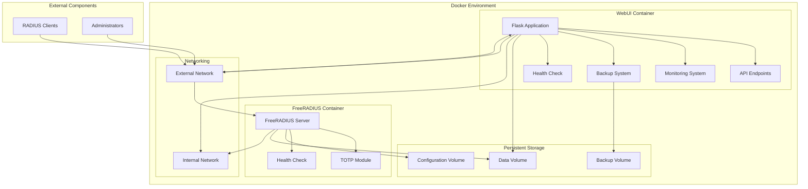

# Phase 4 Implementation Plan: Deployment & Documentation

This document outlines the detailed implementation plan for Phase 4 of the FreeRADIUS TOTP Management System. Phase 4 focuses on finalizing the deployment configuration, creating comprehensive documentation, adding monitoring and backup tools, and preparing deployment guides.

## 1. Finalize Docker Compose Configuration

### 1.1. Optimize Existing Configuration
- Update the Docker Compose file to use the latest version (3.8)
- Add container labels for better organization and management
- Implement proper resource limits for containers (CPU, memory)

### 1.2. Add Health Checks
- Add health check for FreeRADIUS container:
  ```yaml
  healthcheck:
    test: ["CMD", "radclient", "-p", "1812", "localhost", "status", "testing123"]
    interval: 30s
    timeout: 10s
    retries: 3
    start_period: 15s
  ```
- Add health check for WebUI container:
  ```yaml
  healthcheck:
    test: ["CMD", "curl", "-f", "http://localhost:8080/api/health"]
    interval: 30s
    timeout: 10s
    retries: 3
    start_period: 15s
  ```

### 1.3. Configure Restart Policies
- Set appropriate restart policies for both containers:
  ```yaml
  restart: unless-stopped
  ```

### 1.4. Set Up Volume Management
- Create named volumes for persistent data:
  ```yaml
  volumes:
    radius-config:
    radius-data:
  ```
- Update volume mappings in services to use named volumes
- Add volume configuration section with labels and driver options

### 1.5. Ensure Proper Networking
- Configure network with explicit subnet and gateway
- Add network labels for better organization
- Set up proper DNS configuration

### 1.6. Add SSL/TLS Support
- Create a new directory for SSL certificates
- Add script to generate self-signed certificates
- Update WebUI configuration to use SSL certificates
- Update Docker Compose to mount SSL certificates
- Document how to replace self-signed certificates with production certificates

## 2. Create Comprehensive Documentation

### 2.1. Create a Detailed README.md
- Update the main README.md with comprehensive information
- Include project overview, architecture diagram, and key features
- Add detailed installation and configuration instructions
- Include security considerations and best practices

### 2.2. Document System Architecture
- Create architecture.md with detailed system architecture
- Include component diagrams showing interactions between services
- Document data flow and authentication process
- Explain database schema and relationships

### 2.3. Provide Installation and Configuration Guides
- Create installation.md with step-by-step installation instructions
- Include prerequisites and system requirements
- Document configuration options and environment variables
- Provide examples for common deployment scenarios

### 2.4. Create User Manuals for Administrators
- Create admin-guide.md with detailed administration instructions
- Document user management procedures
- Explain TOTP token management
- Detail client configuration and management
- Include monitoring and backup procedures

### 2.5. Document API Endpoints and Usage
- Create api-documentation.md with comprehensive API documentation
- Document authentication methods
- Detail all available endpoints with request/response examples
- Include rate limiting and security considerations

### 2.6. Include Troubleshooting Guides
- Create troubleshooting.md with common issues and solutions
- Include diagnostic procedures
- Document log file locations and formats
- Provide guidance for common error messages

## 3. Add Monitoring and Backup Tools

### 3.1. Implement Container Monitoring
- Add built-in monitoring to the WebUI:
  - Create a new monitoring dashboard in the WebUI
  - Implement system resource monitoring (CPU, memory, disk)
  - Add FreeRADIUS service status monitoring
  - Implement authentication success/failure rate monitoring
  - Create visual graphs for key metrics

### 3.2. Set Up Database Backup and Restore Procedures
- Implement manual backup functionality in the WebUI:
  - Create a new backup management page
  - Add functionality to create on-demand backups
  - Implement backup download functionality
  - Add restore capability from uploaded backups
  - Include backup verification

### 3.3. Create Log Rotation and Archiving
- Implement log rotation for FreeRADIUS logs
- Add log archiving functionality
- Create log viewer in WebUI for archived logs
- Implement log search and filtering

### 3.4. Implement System Health Checks
- Create health check endpoints for both services
- Implement periodic health checks
- Add health status indicators to WebUI dashboard
- Create health check documentation

### 3.5. Add Alerting for Critical Issues
- Implement email alerting for critical issues
- Add configurable alert thresholds
- Create alert history and acknowledgment system
- Document alert configuration

## 4. Prepare Deployment Guides

### 4.1. Create Step-by-Step Deployment Instructions
- Create deployment.md with detailed deployment instructions
- Include initial deployment steps
- Document upgrade procedures
- Provide rollback instructions

### 4.2. Document System Requirements
- Create requirements.md with detailed system requirements
- Include hardware recommendations
- Document software dependencies
- Provide network requirements

### 4.3. Provide Scaling Guidelines
- Create scaling.md with guidance for scaling the system
- Document Docker Swarm deployment for high availability
- Include load balancing configuration
- Provide database scaling options

### 4.4. Include Security Hardening Recommendations
- Create security.md with security hardening recommendations
- Document network security best practices
- Include container security guidelines
- Provide authentication security recommendations

### 4.5. Add Upgrade and Migration Procedures
- Create upgrade.md with detailed upgrade procedures
- Include version migration steps
- Document data migration procedures
- Provide backup and restore instructions for upgrades

## Implementation Sequence

The implementation will follow this sequence:

1. **Docker Compose Optimization**
   - Update Docker Compose file
   - Add health checks and restart policies
   - Configure volumes and networking
   - Implement SSL/TLS support

2. **Monitoring and Backup Tools**
   - Implement system monitoring
   - Add backup and restore functionality
   - Create log rotation and archiving
   - Implement health checks and alerting

3. **Documentation**
   - Create comprehensive README
   - Document system architecture
   - Create installation and configuration guides
   - Document API endpoints
   - Create troubleshooting guides

4. **Deployment Guides**
   - Create deployment instructions
   - Document system requirements
   - Provide scaling guidelines
   - Include security hardening recommendations
   - Add upgrade procedures

## Architecture Diagram



## Monitoring Dashboard Design

```mermaid
graph TD
    subgraph "Monitoring Dashboard"
        subgraph "System Health"
            CPU[CPU Usage]
            MEM[Memory Usage]
            DISK[Disk Usage]
            UPTIME[Uptime]
        end
        
        subgraph "FreeRADIUS Metrics"
            AUTH_RATE[Authentication Rate]
            SUCCESS_RATE[Success Rate]
            FAILURE_RATE[Failure Rate]
            ACTIVE_SESSIONS[Active Sessions]
        end
        
        subgraph "Database Metrics"
            DB_SIZE[Database Size]
            DB_GROWTH[Growth Rate]
            USER_COUNT[User Count]
            CLIENT_COUNT[Client Count]
        end
        
        subgraph "Alerts"
            ALERT_LIST[Alert List]
            ALERT_HISTORY[Alert History]
            ALERT_CONFIG[Alert Configuration]
        end
    end